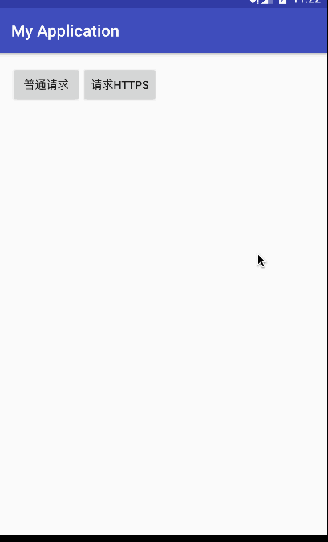
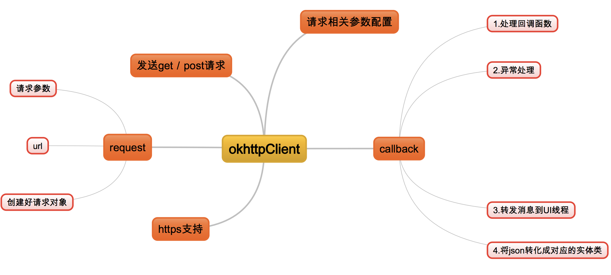

### 对okhttp的二次封装

#### okhttp大家都很熟悉了，但是如果没有一个好的封装的话，每次都会写很多冗余的代码，而且如果以后项目中不再使用okHttp了，那么应用层需要做大量的修改，所以这样维护起来太差了，需要好好封装一下。封装后达到的效果如下:

  * 通过一行代码的调用 发送请求
  * 自定义callback,处理回调结果，可以将json转化成实体类
  * 支持 https

#### 先看看运行效果：


#### 进行封装之前，需要梳理一下okhttp知识，我画了一张图:



>可以看到整个okhttp最核心的三点，分别是request、okHttpClient、callBack。 request可以携带一些参数，然后通过okHttpClient发送请求到服务端，然后通过callback回调给我们数据或者异常信息。所以封装的时候，也应该从这三点考虑，观察相同点与不同点，从而进行封装

#### 一般情况下，okhttp发送一个get请求是这样的：
```
//创建okHttpClient对象
OkHttpClient mOkHttpClient = new OkHttpClient();
//创建一个Request
final Request request = new Request.Builder()
                .url("https://github.com/")
                .build();
//new call
Call call = mOkHttpClient.newCall(request);
//请求加入调度
call.enqueue(new Callback()
        {
            @Override
            public void onFailure(Request request, IOException e)
            {
            }
            @Override
            public void onResponse(final Response response) throws IOException
            {
                    //String htmlStr =  response.body().string();
            }
        });
```
> 这还是最简单的发送请求，也没对okHttpClient进行配置，如果项目中有多处要使用okhttp进行网络请求，会造成代码冗余。下面开始封装：

  * 首先封装一个`CommonRequest` 创建request对象

```
/**
 * Created by gechuanguang on 2017/2/17.
 * 邮箱：1944633835@qq.com
 * @function 接收请求参数，为我们生成Request对象
 */
public class CommonRequest {
    /**
     * @param url
     * @param params
     * @return 返回一个创建好post的Request对象
     */
    public  static Request createPostRequest(String  url, RequestParams params){

        FormBody.Builder mFormBodybuilder = new FormBody.Builder();
        if(params!=null){
            for(Map.Entry<String,String> entry: params.urlParams.entrySet()){
                // 将请求参数逐一添加到请求体中
                mFormBodybuilder.add(entry.getKey(),entry.getValue());
            }
        }
        FormBody mFormBody=mFormBodybuilder.build();
        return  new Request.Builder()
                .url(url)
                .post(mFormBody)
                .build();
    }

    /**
     * @param url
     * @param params
     * @return 返回一个创建好get的Request对象
     */
    public  static Request createGetRequest(String  url, RequestParams params){

        StringBuilder urlBuilder=new StringBuilder(url).append("?");
        if(params!=null){
            for(Map.Entry<String,String> entry: params.urlParams.entrySet()){
                // 将请求参数逐一添加到请求体中
                urlBuilder.append(entry.getKey()).append("=")
                        .append(entry.getValue())
                        .append("&");
            }
        }
        return  new Request.Builder()
                .url(urlBuilder.substring(0,urlBuilder.length()-1)) //要把最后的&符号去掉
                .get()
                .build();
    }

    /**
     * 文件上传请求
     *
     * @return
     */
    private static final MediaType FILE_TYPE = MediaType.parse("application/octet-stream");

    public static Request createMultiPostRequest(String url, RequestParams params) {

        MultipartBody.Builder requestBody = new MultipartBody.Builder();
        requestBody.setType(MultipartBody.FORM);
        if (params != null) {
            for (Map.Entry<String, Object> entry : params.fileParams.entrySet()) {
                if (entry.getValue() instanceof File) {
                    requestBody.addPart(Headers.of("Content-Disposition", "form-data; name=\"" + entry.getKey() + "\""),
                            RequestBody.create(FILE_TYPE, (File) entry.getValue()));
                } else if (entry.getValue() instanceof String) {

                    requestBody.addPart(Headers.of("Content-Disposition", "form-data; name=\"" + entry.getKey() + "\""),
                            RequestBody.create(null, (String) entry.getValue()));
                }
            }
        }
        return new Request.Builder()
                .url(url)
                .post(requestBody.build())
                .build();
    }
}
```
> CommonRequest包含了 创建好post的Request对象、 创建好get的Request对象、 以及创建好文件上传的Request对象，这样通过CommonRequest调用对应的静态方法即可得到对应的request对象。接下来就可以封装okhttpClient来发送请求

  * 封装`CommonOkhttpClient`

```
/**
 * Created by gechuanguang on 2017/2/17.
 * 邮箱：1944633835@qq.com
 * @function 创建okHttpclient对象，并且配置支持https，以及发送请求
 */
public class CommonOkhttpClient {

    private static final int TIME_OUT = 30;
    private static OkHttpClient mOkHttpClient=null;

    //为mOkHttpClient去配置参数  类加载的时候开始创建静态代码块，并且只执行一次
    static {
        OkHttpClient.Builder okHttpClientBuilder = new OkHttpClient.Builder();
        okHttpClientBuilder.connectTimeout(TIME_OUT, TimeUnit.SECONDS);
        okHttpClientBuilder.writeTimeout(TIME_OUT, TimeUnit.SECONDS);
        okHttpClientBuilder.readTimeout(TIME_OUT, TimeUnit.SECONDS);
        okHttpClientBuilder.followRedirects(true); //设置重定向 其实默认也是true

        /*--添加请求头  这个看个人需求 --*/
//        okHttpClientBuilder.addInterceptor(new Interceptor() {
//            @Override
//            public Response intercept(Chain chain) throws IOException {
//                Request request = chain.request()
//                        .newBuilder()
//                        .addHeader("User-Agent", "Android—Mobile") // 标明发送本次请求的客户端
//                        .build();
//                return chain.proceed(request);
//            }
//        });

        //添加https支持
        okHttpClientBuilder.hostnameVerifier(new HostnameVerifier() {
            @Override
            public boolean verify(String s, SSLSession sslSession) {
                return true;
            }
        });
        /**
         * trust all the https point
         */
        okHttpClientBuilder.sslSocketFactory(HttpsUtils.initSSLSocketFactory(),HttpsUtils.initTrustManager());
        mOkHttpClient = okHttpClientBuilder.build();
    }

    /**
     *  发送具体的http/https的请求
     * @param request
     * @param commonCallback
     * @return Call
     */
    public  static Call sendRequest(Request request, CommonJsonCallback commonCallback){
        Call call=mOkHttpClient.newCall(request);
        call.enqueue(commonCallback);
        return  call;
    }

    /**
     *  发送具体的http/https的请求
     * @param request
     * @param commonCallback
     * @return Call
     */
    public  static Call sendRequest(Request request, Callback commonCallback){
        Call call=mOkHttpClient.newCall(request);
        call.enqueue(commonCallback);
        return  call;
    }
}

```

> 这个CommonOkhttpClient中配置好了okHttpClient，可以支持https请求，如果使用的是Retrofit网络请求框架的话，可以设置这个okhttpClient配置的，这样retrofit也是支持https的。还有一点需要注意，我并没有使用默认的CallBack回调，而是封装了一层CommonJsonCallback，
因为默认的Callback是回调在子线程的，在更新UI的时候还需要切换到主线程，而且多数时候还需要将Json字符串转化成实体类，使用默认的Callback非常不方便。所以我是将这些操作封装到CommonJsonCallback来完成，避免每次切换线程以及将json转化成实体类重复的操作。（ps：有个问题值得思考，为啥okhttp callback是回调在子线程的。个人感觉之所以回调在子线程，应该是有他的道理的，比如说我们下载一个很大文件，那么回调的这个response数据肯定很大，肯定需要以流的形式转移到手机SD卡，需要在子线程边下载边转移，避免内存溢出）

  *  `CommonJsonCallback`  专门处理JSON的回调

```
public class CommonJsonCallback implements Callback {

    /**
     * the logic layer exception, may alter in different app
     */
    protected final String RESULT_CODE = "ecode"; // 有返回则对于http请求来说是成功的，但还有可能是业务逻辑上的错误
    protected final int RESULT_CODE_VALUE = 0;
    protected final String ERROR_MSG = "emsg";
    protected final String EMPTY_MSG = "";
    protected final String COOKIE_STORE = "Set-Cookie"; // decide the server it
    // can has the value of
    // set-cookie2

    /**
     * the java layer exception, do not same to the logic error
     */
    protected final int NETWORK_ERROR = -1; // the network relative error
    protected final int JSON_ERROR = -2; // the JSON relative error
    protected final int OTHER_ERROR = -3; // the unknow error

    /**
     * 将其它线程的数据转发到UI线程
     */
    private Handler mDeliveryHandler;
    private DisposeDataListener mListener;
    private Class<?> mClass;

    public CommonJsonCallback(DisposeDataHandle handle) {
        this.mListener = handle.mListener;
        this.mClass = handle.mClass;
        this.mDeliveryHandler = new Handler(Looper.getMainLooper());
    }

    @Override
    public void onFailure(final Call call, final IOException ioexception) {
        /**
         * 此时还在非UI线程，因此要转发
         */
        mDeliveryHandler.post(new Runnable() {
            @Override
            public void run() {
                mListener.onFailure(new OkHttpException(NETWORK_ERROR, ioexception));
            }
        });

    }
    @Override
    public void onResponse(final Call call, final Response response) throws IOException {
        final String result = response.body().string();
        final ArrayList<String> cookieLists = handleCookie(response.headers());
        mDeliveryHandler.post(new Runnable() {
            @Override
            public void run() {
                handleResponse(result);
                /**
                 * handle the cookie
                 */
                if (mListener instanceof DisposeHandleCookieListener) {
                    ((DisposeHandleCookieListener) mListener).onCookie(cookieLists);
                }
            }
        });
    }
    private ArrayList<String> handleCookie(Headers headers) {
        ArrayList<String> tempList = new ArrayList<String>();
        for (int i = 0; i < headers.size(); i++) {
            if (headers.name(i).equalsIgnoreCase(COOKIE_STORE)) {
                tempList.add(headers.value(i));
            }
        }
        return tempList;
    }
    private void handleResponse(Object responseObj) {
        if (responseObj == null || responseObj.toString().trim().equals("")) {
            mListener.onFailure(new OkHttpException(NETWORK_ERROR, EMPTY_MSG));
            return;
        }
        try {
            /**
             * 协议确定后看这里如何修改
             */
//            JSONObject result = new JSONObject(responseObj.toString());
            String result=responseObj.toString();
            if (mClass == null) {

                //发送JSONObject类型
//                mListener.onSuccess(result);
                // 发送json字符串
                mListener.onSuccess(result);

            } else {
                /*--将json转化成实体类--*/
                Object obj = JsonUtils.fromJson(result.toString(), mClass);
                if (obj != null) {
                    mListener.onSuccess(obj);
                } else {
                    mListener.onFailure(new OkHttpException(JSON_ERROR, EMPTY_MSG));
                }
            }
        } catch (Exception e) {
            mListener.onFailure(new OkHttpException(OTHER_ERROR, e.getMessage()));
            e.printStackTrace();
        }
    }
}
```

> CommonJsonCallback的构造方法传入的有DisposeDataHandle，

  * `DisposeDataHandle`

```
public class DisposeDataHandle
{
	public DisposeDataListener mListener = null;
	public Class<?> mClass = null;
	public String mSource = null;

	public DisposeDataHandle(DisposeDataListener listener)
	{
		this.mListener = listener;
	}

	public DisposeDataHandle(DisposeDataListener listener, Class<?> clazz)
	{
		this.mListener = listener;
		this.mClass = clazz;
	}

	public DisposeDataHandle(DisposeDataListener listener, String source)
	{
		this.mListener = listener;
		this.mSource = source;
	}
}
```

> DisposeDataHandle需要传入具体的请求回调 ，也就是DisposeDataListener

  * `DisposeDataListener`

```
public interface DisposeDataListener<T> {

	/**
	 * 请求成功回调事件处理
	 */
	public void onSuccess(T t);

	/**
	 * 请求失败回调事件处理
	 */
	public void onFailure(Object reasonObj);

}
```

#### 封装到此告一段落，接下来看如何使用了。。

  * 如果需要将json转化成实体类对象，需要给DisposeDataListener指定泛型，并且在最后还要传入DataBean.class：

```
  CommonOkhttpClient.sendRequest(CommonRequest.createGetRequest(UrlConstant.wxUrl,null),
                        new CommonJsonCallback(new DisposeDataHandle(new DisposeDataListener<DataBean>() {
                            @Override
                            public void onSuccess(DataBean bean) {
                                mTextView.setText("onSuccess:"+bean.getAds().toString());
                            }
                            @Override
                            public void onFailure(Object reasonObj) {
                                mTextView.setText("onFailure:"+reasonObj.toString());
                            }
                        },DataBean.class)));
```

  * 如果想直接返回json字符串,需要给DisposeDataListener指定泛型为String即可

```
  CommonOkhttpClient.sendRequest(CommonRequest.createGetRequest(UrlConstant.wxUrl,null),
                        new CommonJsonCallback(new DisposeDataHandle(new DisposeDataListener<String>() {
                            @Override
                            public void onSuccess(String json) {
                                mTextView.setText("onSuccess:"+json);
                            }
                            @Override
                            public void onFailure(Object reasonObj) {
                                mTextView.setText("onFailure:"+reasonObj.toString());
                            }
                        })));

```

> 这样写的好处在于，单纯从这段代码来看，并没有暴露出我们具体使用的是okhttp还是其他网络框架，也就是说，如果以后要更换其他网络请求框架的话，应用层的代码就不用改变了。

#### 其实这样看起来还不够好，在具体项目中，我会创建一个RequestManager来管理这些请求，真正达到一行代码实现发送请求

```
/**
 * Created by gechuanguang on 2017/2/22.
 * 邮箱：1944633835@qq.com
 * @Function  来管理一些网络请求
 */
public class RequestManager {


    //根据参数发送所有get请求
    private static void getRequest(String url, RequestParams params, DisposeDataListener<?> listener, Class<?> clazz) {
        CommonOkhttpClient.sendRequest(CommonRequest.createGetRequest(url,params),
                new CommonJsonCallback(new DisposeDataHandle(listener,clazz)));
    }

    //根据参数发送所有post请求
    private static void postRequest(String url, RequestParams params, DisposeDataListener listener, Class<?> clazz) {
        CommonOkhttpClient.sendRequest(CommonRequest.createPostRequest(url,params),
                new CommonJsonCallback(new DisposeDataHandle(listener,clazz)));
    }

    /**
     * 请求主页数据
     *
     * @param listener
     */
    public static void requestHomeData(Class clazz,DisposeDataListener<?> listener) {
        RequestManager.getRequest(UrlConstant.wxUrl,null,listener,clazz);
    }

    /**
     *  Login
     *
     */
}
```

#### 然后在其他地方 就可以这么去发送请求：

```
  RequestManager.requestHomeData(DataBean.class, new DisposeDataListener<DataBean>() {
                    @Override
                    public void onSuccess(DataBean bean) {
                        mTextView.setText(bean.getAds().toString());
                    }

                    @Override
                    public void onFailure(Object reasonObj) {
                        mTextView.setText(reasonObj.toString());
                    }
                });
```

> 这样看起来更加简洁了，降低了代码之间的耦合的，在应用层只要关心是请求登录接口还是主页接口，以及回调成功或失败即可

